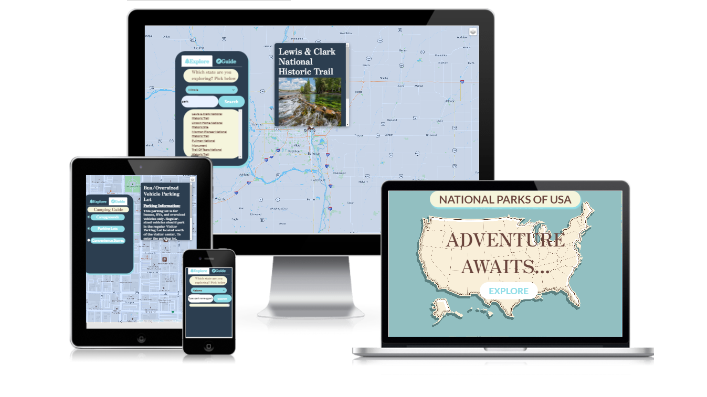
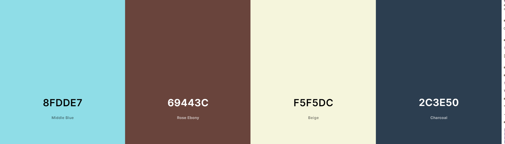

# **Adventure Awaits...**

Link to demo : [Adventure Awaits...](https://naushadbegum.github.io/Project-1-USA-National-Parks/)

## Summary
There are over 423 National Parks in the USA across 50 states. Nature enthusiats love visiting these places and stay overnight at the parks. Moreover, roadtrippers and tourists often travel across different states to visit the parks. 

Adventure Awaits is a web based software application that helps nature enthusiasts, roadtrippers and tourits to plan their visit. Tourist usually visit the popular National Parks such as Grand Canyon at Arizona as there are more information about them.

Our aim is to break the information barrier for all the National Parks in the USA and provide access to the parks, campgrounds, parking lots and convinience stores for the visitors. 

---

## UI/UX
### Strategy
### Organisational Goals
Every National Park in the USA is a jewel. As a nature enthusiast myself, I do not know the information for most of the National Parks. I would usually search for the information based on the name of the park and visit the place. However, I have come to the realisation that there are many parks in every state and I do not even know the name of them. It would be ideal if there is an application that provides information of the parks based on the states that user is visiting and provides information about the campgrounds, parking lots and convinience stores for the campers, nature enthusiasts, hikers and roadtrippers. 

### User Goals
The users of Adventure Awaits are mostly hikers, nature enthusiasts, roadtrippers and tourists. The aim of the users is to be able to find all the parks, campgrounds and  parking lots in a state. After the user has chosen the park to visit, they are also able to see the convineance store nearby as well. 
| User Stories | Accceptance Criteria |
| ----------- | ----------- |
| As a hiker, after a long day of hiking in the National parks and I would love to stay overnight at the campgrounds nearby. | Campgrounds based on the states can be marked in the map so user can select a campground near the park he is hiking. |
| As a roadtripper, I will be driving long distance and would need to know the convinience shops nearby to buy essentials. | Convinience stores can be marked in the map within the nearby radius.|
| As a nature enthusiast, I want to visit all the National Parks in my state. | National Parks can be searched based on the state. |

### Design Decisions

#### Color scheme

The color scheme chosen revolves around turquoise, dark blue and brown as it represents the sea and land respectively. It represents the theme of adventure and travelling in the sea and land.  It also captures the image of parks with natural sand formations and water.

#### Fonts

*Serif* is a font family used for apt giving the user the feeling of adventurous and exploration. *Sans-serif* was mainly used to ensure that the words are clear when read. 
---

## Features

| Features | Description |
| ----------- | ----------- |
| Search parks by name and state | These features allow the user to select the state and search based on the name of the park. This will be convenient for users as there are many national parks in the USA. Searching by states helps to narrow down the search.|
| View Campgrounds in the selected state | Users are able to view all the campgrounds in every state and click on the markers. The popup from the marker will provide photo and the address which is very important for travellers. |
| View Parking Lots in the selected state | Users are able to view all the parking lots in every state and click on the markers. The popup from the marker will provide information about the parking lots. It will provide information such as the number of cars can be parked and also the type of cars that can be parked.|
| View Convenience stores in the selected state | Users are able to view all the covenience within 10km radius of the map view. The markers will show the name of the shop. |
---

## Limitations and Future Implementations

1. Design a more user friendly search engine
    - Current limitation : 
        - The current search feature can only handle queries that match the park names and in that particular state. Users need to key in the park name correctly. 
    - Future implementation : 
        - Suggestions can be given while the user is typing and especially if user has typo errors in the query 
2. Adding hiking trials for the parks
    - Current limitation :
        - The website provides information such as photo, address, campgrounds and parking lots of the parks based on the information from nps.gov.
    - Future implementation :
        - Hiking trials based on state can be added to the map. This will be useful not just for hikers but also for tourists who are visiting for the first time as well. 
3. Separate the Guide tab without the need to 
    - Current limitation : 
         - User needs to select a state in the dropdown list before clicking on the campgrounds, parking lots and convinience stores. 
    - Future implementation :
        - Dropdown list can be added to the guide tab as well so that users can select from the tab and click on campgrounds, parking lots and convinience stores. 
4. Add weather feature 
    - Current limitation :
        - Due to time limitation, was not able to add the weather feature to the application.
    - Future implementation :
        - Using the open weather api, weather can be added to the map. A weather forcast feature will be very useful for the visitors. 

---

## Technologies Used

1. HTML

2. CSS

3. [Bootstrap 5](https://getbootstrap.com/docs/5.0/getting-started/introduction/) 
    - Used for buttons, tabs and offcanvas of website

4. JavaScript

5. [Axios](https://github.com/axios/axios)
    - Used to fetch data from APIs used by website

6. [LeafletJS](https://leafletjs.com/)
    - Used to render interactive map used by website
---

## Testing

The website is tested for responsiveness using Developer Tools on Chrome browser for mobile, tablet and desktop screen widths.
The test cases can be found [here](test-cases.pdf).

---

## Deployment

The website is hosted using [Github](https://www.github.com/), deployed directly from the main branch of the Github repository.

---

## Credits and Acknowledgement
### Fonts :
1. [Google Fonts](https://fonts.google.com/) - Used for fonts displayed in website 
### Icons :
1. [Font Awesome](https://fontawesome.com/) - Used in tabs and buttons of website
### Data :
1. [Nps.gov](https://https://www.nps.gov/subjects/developer/api-documentation.htm/)
    - The dataset was used to display the parks information, campgrounds, parkinglots and photos on the website 
2. [Foursquare.com](https://foursquare.com/)
- The dataset was used to display convinience stores within the radius.
### Screenshot :
1. [CreateMockup.com](https://www.createmockup.com/generate/) - Used to generate responsive website mockup for README file
2. [Coolors.co](https://coolors.co/) -Used to generate the colour scheme for the project
### Background photo:
1. [Freepik.com](https://www.freepik.com) -Used for the background image of the introduction page
